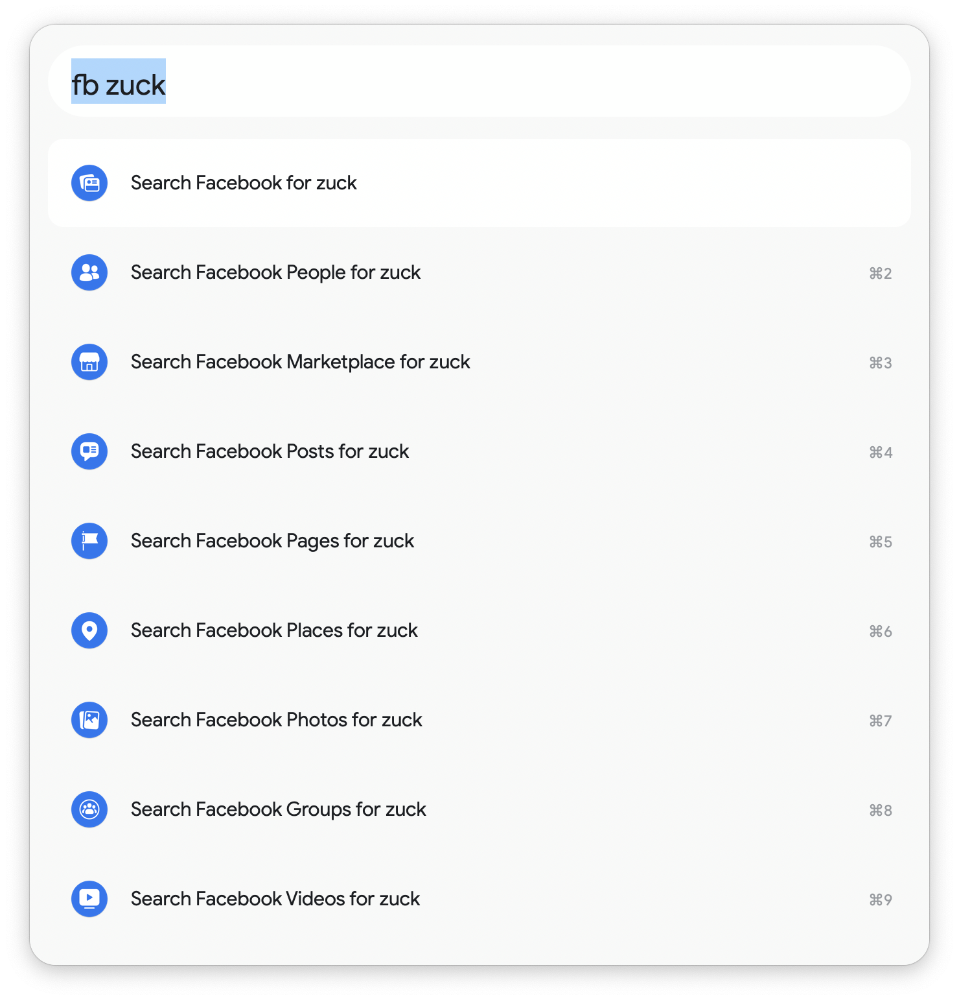
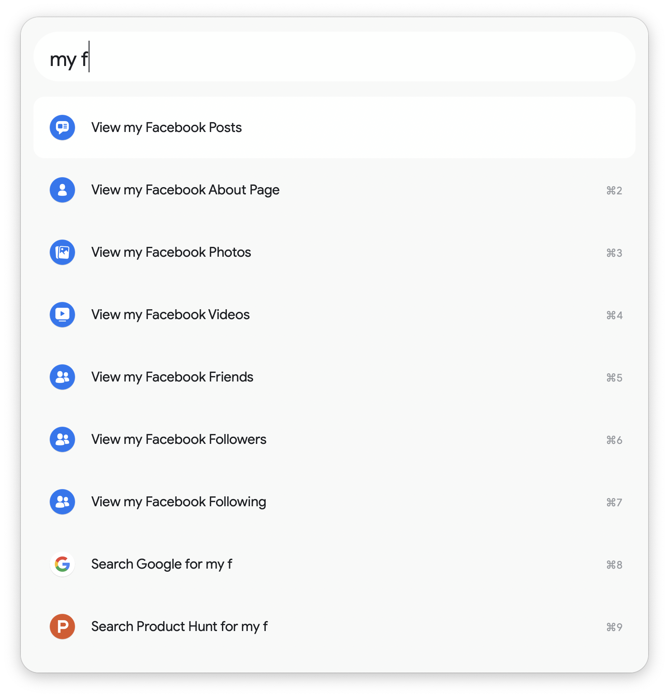
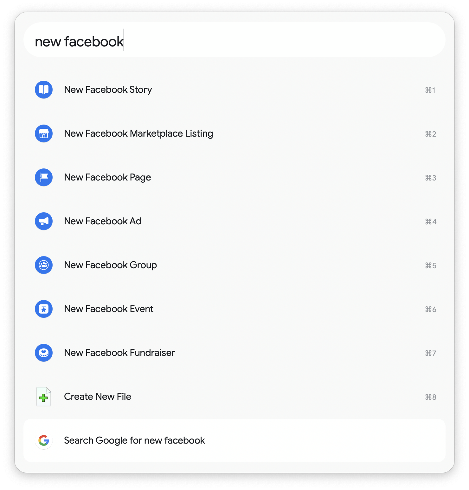
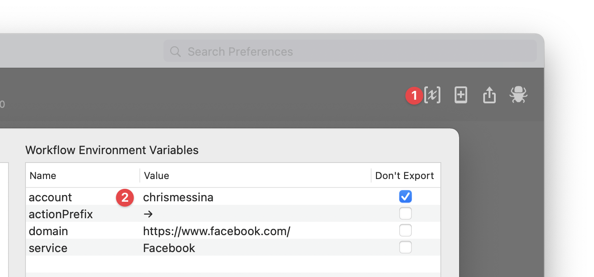

# Facebook Toolkit for Alfred

The Facebook Toolkit for Alfred makes it easy to quickly access Facebook's web features, including messaging, faceted search, and more using the `fb` keyword.

This toolkit provides convenient shortcuts your own content (using the `my` keyword):

You can also create new stories, marketplace listings, pages, groups, ads, events, and fundraisers with the `new` keyword:

This workflow does not support programmatic access to Facebook, like posting photos directly or sending DMs.

# Installation

1. Download the [latest release here](https://github.com/chrismessina/alfred-facebook-toolkit/releases/latest).
2. Double-click the `.alfredworkflow` to install it.

_You will need to be an [Alfred Powerpack](https://www.alfredapp.com/powerpack/) user to enable this workflow._

# Configuration

Once the workflow is installed, launch **Alfred Preferences**, choose **Workflows** and then select **Facebook Toolkit**.

➊ Access the **Workflow Environment Variables** in the top right of the window:

## Set your username

This workflow makes it easy to access your own profile and different content types.

➋ To configure this feature, you must set the `account` variable in the configuration to *your own username*.

# Changelog[¹](https://keepachangelog.com/)

## [v0.1.0] - 2021-05-10
- Initial Release

# About

This workflow is unaffiliated with nor endorsed by Facebook, Inc.

You can [file bugs](https://github.com/chrismessina/alfred-facebook-toolkit/issues/new) or [submit feature requests](https://github.com/chrismessina/alfred-facebook-toolkit/issues/new).
